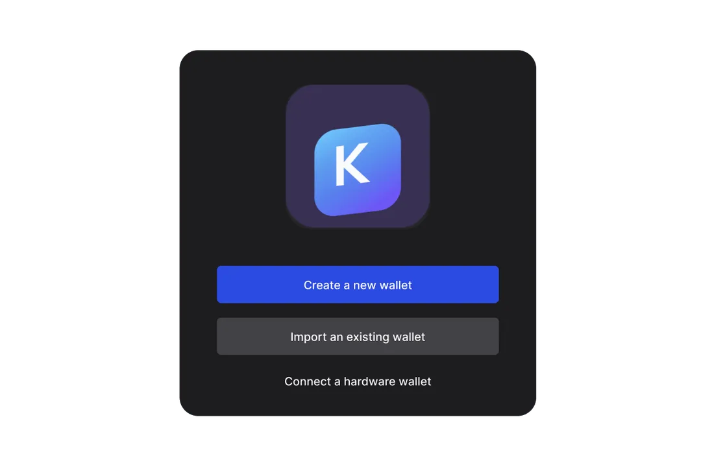

# Set up a Keplr Wallet

<figure><figcaption></figcaption></figure>

### Step 1 - Installation

<figure><figcaption></figcaption></figure>

Go to Keplr's extension download for[ Chrome or Brave](https://chromewebstore.google.com/detail/keplr/dmkamcknogkgcdfhhbddcghachkejeap?hl=en); [Firefox](public-testnet/run-a-layer-node.md)&#x20;

Then, in following window pop-up, select \[Add extension] and it will be automatically added to your  browser.

Once the extension is added, you may need to select the puzzle icon on the top right of your Chrome browser

<figure><figcaption>
click the puzzle icon
</figcaption></figure>

and then select the Keplr pin to have the Keplr icon link be visible in your browser bar.

<figure><figcaption>
Pin your Keplr Chrome extension
</figcaption></figure>

<figure><figcaption>
Keplr is now on your browser bar
</figcaption></figure>

## Next, you'll need to create an account to access the wallet's features.&#x20;

**Step 2**

Click on the Keplr icon on your browser extension bar to open the wallet creation page.

Click on 'Create new wallet'

<figure><figcaption></figcaption></figure>

**Step 3: Create a new wallet**

Keplr extension currently offers two options for creating an account.\
\
For higher security we would recommend registering via recovery phrase.\
\
If you are a beginner and are less experienced with self-custodial wallets, you can also choose to sign up with your Google or Apple IDs. (However, note that a compromised Google or Apple account can lead to loss of funds)

<figure><figcaption></figcaption></figure>

Step 4: New Recovery Phrase

You can choose either 12 or 24 Recovery Phrase words for your new wallet.\

🚫 DO NOT share your recovery phrase with ANYONE. Anyone with your recovery phrase can take your assets. Please stay vigilant against phishing attacks at all times.

🔒 Back up the phrase safely. You will lose your assets if you lose your recovery phrase. We recommend you always store it offline. Keplr does not store your recovery phrase.

Verify your Recovery Phrase words on the next page and fill the information as required and click 'Next'. \

<figure><figcaption></figcaption></figure>

**Step 5: Select Chains**

On the 'Select Chains' page, Cosmos Hub will remain selected by default. Layer network will be available once the mainnet launches.

Proceed to the end of the registration process.  If you see this page, then your account has been successfully created and the Keplr Extension is ready for use:

<figure><figcaption></figcaption></figure>

## **Connect Hardware Wallet**

Install the 'Cosmos' app on your Ledger using Ledger Live.

Click on Connect Hardware Wallet, then 'Connect Ledger' on the Keplr app.

Step 1

Set a name for your wallet. Click 'Next'.

Connect and unlock your Ledger. Open the Cosmos app on your Ledger device and click on Next.

<figure><figcaption></figcaption></figure>

Step 2

On the Select Chains page, Cosmos Hub will remain selected by default. Layer network will be available once the mainnet launches.

Click on 'Finish' to close the registration instructions.

<figure><figcaption></figcaption></figure>

\
